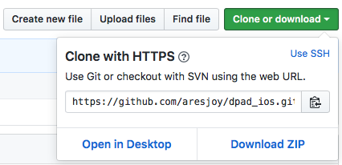
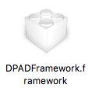
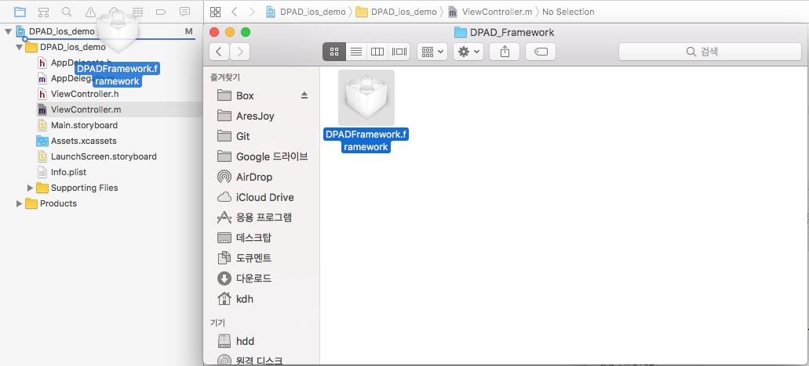
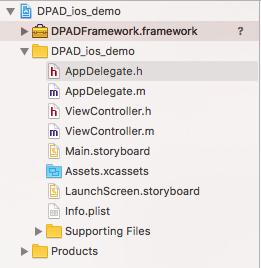
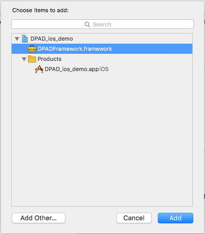

# DPAD SDK 연동하기 : iOS 네이티브
본 가이드는 iOS 네이티브 프로젝트에서 DPAD SDK를 연동하기 위한 문서입니다.
DPAD에 대한 서비스 소개나 이용방법 안내는 아래 아티클에서 확인하실 수 있습니다.

서비스 이용 중 도움이 필요한 경우에는 아래 메일 주소로 연락 부탁 드립니다.
1. 서비스 이용 및 제휴 문의 - ( help@aresjoy.com )
2. 기술 문의 : iOS개발팀 ( tech@aresjoy.com )
***

## 버전 이력
v0.0.1 : 데모 프로젝트 업로드

v1.0 : 초기 프로젝트 업로드

v1.1 : 실버전 테스트 보안 업데이트

v1.1.1 : iOS14 IDFA 권한관련 추가 업데이트

v2.0.0 : 광고 종류 Tab UI 적용, 네트워크 모듈 최신화, 성능 최적화
***

## SDK 설치

### SDK 다운로드
GitHub Repositary( https://github.com/aresjoy/dpad_ios.git )에서 프로젝트를 클론하거나 소스를 다운로드 받습니다.



### 파일 확인
해당경로 ( Path: ~/repasitory/DPAD_Framework/DPADFramework.framework )에 파일이 잘 받아졌는지 확인합니다.




## 프로젝트 & 소스 연동

### 프로젝트에 SDK 추가
- 진행하려는 프로젝트에 다운로드 받은 Framework파일을 Drag & Drop하여 추가합니다.



- SDK 파일이 추가된 상태입니다.




### 프레임워프 링크 연결 확인
- Project > General 탭에서 **Embedded Binaries**와 **Linked Frameworks and Libraries** 카테고리에 Framework 파일이 제대로 연결이 되었는지 확인합니다.


- 둘 중 하나라도 연결되어 있지 않으면 SDK 제대로 작동하지 않으므로 +버튼을 눌러서 추가한 DPADFramework.framework 파일을 연동시켜줍니다.




### 소스연동
#### Pub ID 및  App ID 설정
- 발급 받은 **Pub ID**와 **App ID**를 등록합니다.
> Objective-C
```objc
#import "AppDelegate.h"
#import "DPADFramework.h"

@interface AppDelegate ()

@end

@implementation AppDelegate


- (BOOL)application:(UIApplication *)application didFinishLaunchingWithOptions:(NSDictionary *)launchOptions {
    // Override point for customization after application launch.
    
    [DPManager initManagerWithPubID:@"[발급받은 Pub ID 입력]" appID:@"[발급받은 App ID 입력"];
    
    return YES;
}
```
> Swift
```swift
import UIKit
import DPADFramework

@UIApplicationMain
class AppDelegate: UIResponder, UIApplicationDelegate {

    var window: UIWindow?

    func application(_ application: UIApplication, didFinishLaunchingWithOptions launchOptions: [UIApplicationLaunchOptionsKey: Any]?) -> Bool {
        // Override point for customization after application launch.
        
        DPManager.initManager(withPubID: "[발급받은 Pub ID 입력]", appID: "[발급받은 App ID 입력]")
        
        return true
    }
}
```
- Notice : Pub ID와 App ID는 AppDelegate가 아닌 다른 곳에서 등록해도 무방하며 OfferWall을 보여주기 전에만 설정하면 됩니다.


#### User ID 설정
- 사용자를 식별하기 위한 User ID값을 등록합니다.
> Objective-C
```objc
[DPManager sharedManager].userID = @"[사용자 고유 ID]";
```

> Swift
```swift
DPManager.shared().userID = "[사용자 고유 ID]"
```

#### Offer Wall 기능 실행
- DPAD(Don Push Ad) 오퍼월을 실행하기 위한 메소드를 입력합니다.
> Objective-C
```objc
[[DPManager sharedManager] showOFW];
```

> Swift
```swift
DPManager.shared().showOFW()
```
